# Tugas 4 - Praktikum Pemrograman Berbasis Mobile

**Nama:** Sakahayu Pribadi \
**NPM:** 4522210062 \
**Dosen Pengampu:** Adi Wahyu Pribadi S.SI., M.Kom. \
**Program Studi:** Teknik Informatika \
**Universitas Pancasila - 2025**

## Deskripsi

Proyek Flutter ini merupakan tugas praktikum ke-4 pada mata kuliah Pemrograman Berbasis Mobile. Proyek ini menampilkan scene interaktif dengan gesture, drag-and-drop, efek visual, dan fitur zoom/pan menggunakan `PageView`.

---

## 💪 Langkah-langkah Pengerjaan

### 1. Buat Proyek Baru

Inisialisasi proyek Flutter baru menggunakan perintah:

```bash
flutter create tugas_praktikum_storybook
```

### 2. Buka Code Editor

Gunakan code editor seperti VS Code atau Android Studio untuk mulai mengembangkan aplikasi.

### 3. Struktur Folder

Di dalam direktori `lib`, buat folder `pages` dan tambahkan 3 file:

* `title_page.dart`
* `scene_page.dart`
* `end_page.dart`

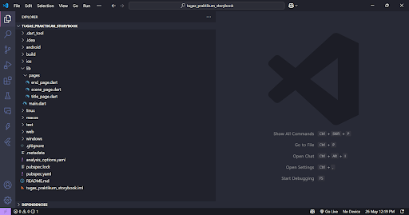

### 4. Struktur `PageView`

Buka `lib/main.dart` dan isi dengan struktur `PageView` yang menavigasi ketiga halaman.

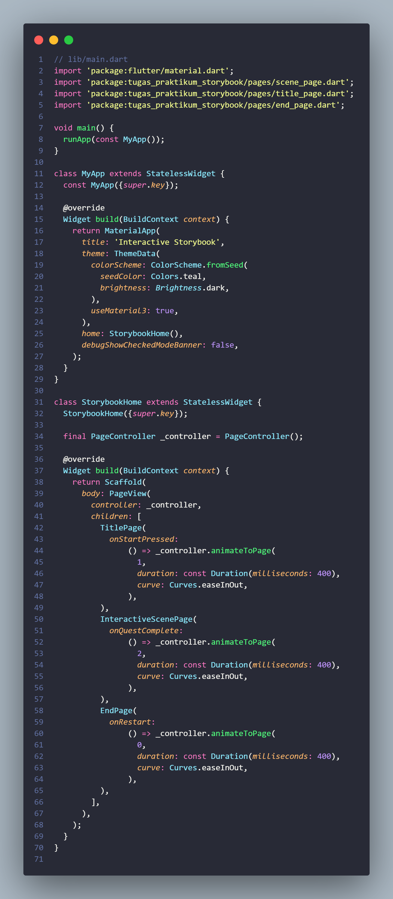

### 5. Boilerplate Widget

Setiap file di folder `pages` diisi dengan `StatelessWidget` sederhana. Contoh untuk `title_page.dart`:

```dart
import 'package:flutter/material.dart';

class TitlePage extends StatelessWidget {
  @override
  Widget build(BuildContext context) {
    return Scaffold(
      body: Center(child: Text('Halaman Judul')),
    );
  }
}
```

### 6. Halaman Lainnya

Lakukan hal yang sama untuk `scene_page.dart` dan `end_page.dart`, masing-masing menampilkan teks judul halaman.

### 7. StatefulWidget di `scene_page.dart`

Ganti isi `scene_page.dart` dengan kerangka `StatefulWidget` untuk menampung interaksi pengguna.

### 8. Double Tap: Astronaut & Dialog

Di dalam `Stack`, tambahkan `Positioned` untuk astronaut dan tampilkan dialog saat elemen diketuk dua kali (`onDoubleTap`).

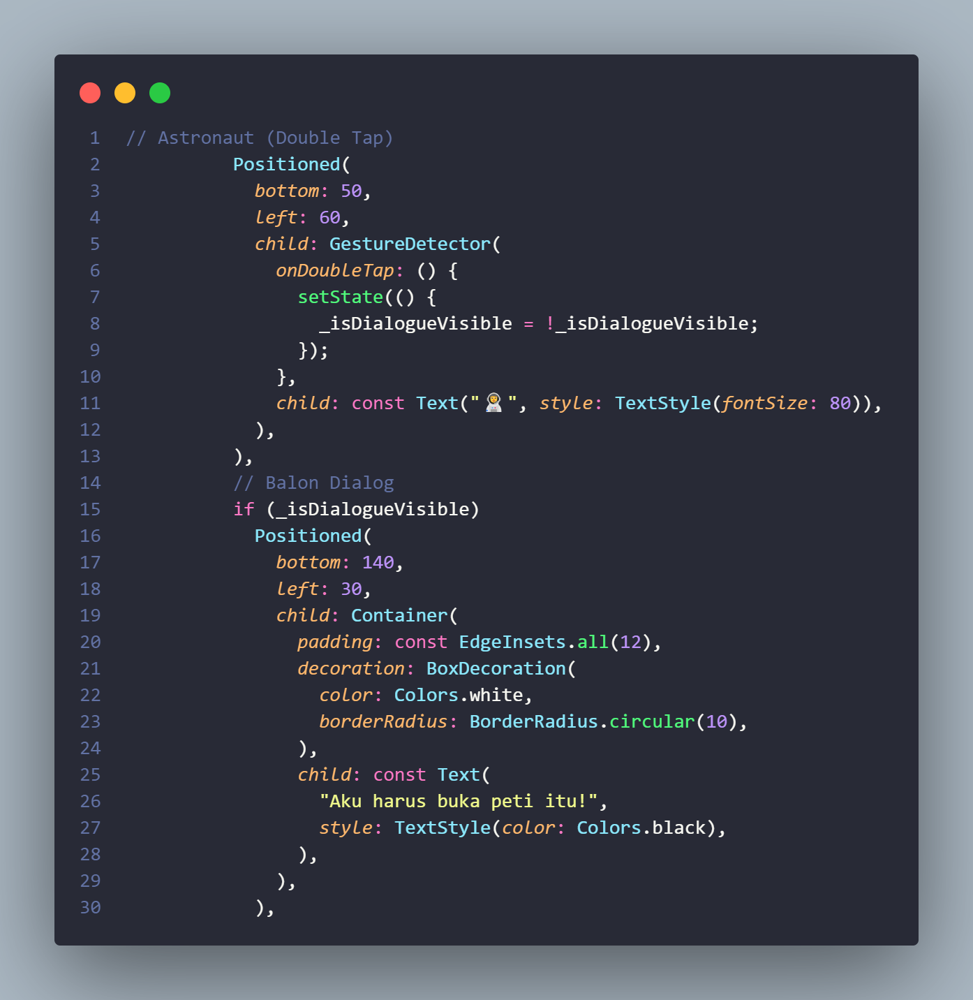
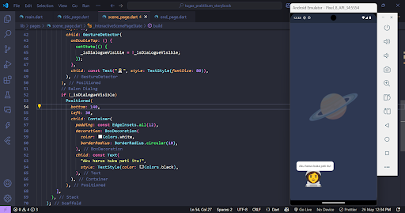

### 9. Long Press: Peti & Petunjuk

Tambahkan `Positioned` untuk peti. Tampilkan petunjuk saat pengguna melakukan long press.

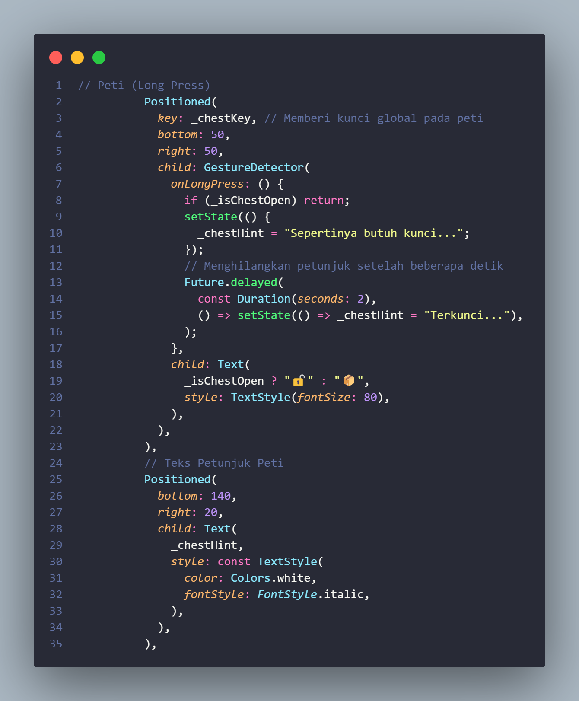
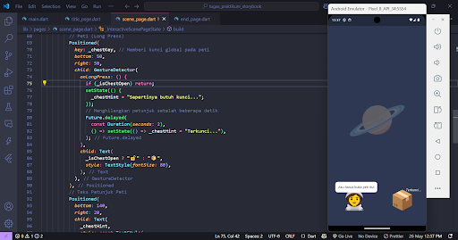

### 10. Drag-and-Drop: Kunci

Tambahkan `Positioned` untuk objek kunci dan implementasikan logika drag-and-drop ke peti. Ini adalah bagian paling kompleks.

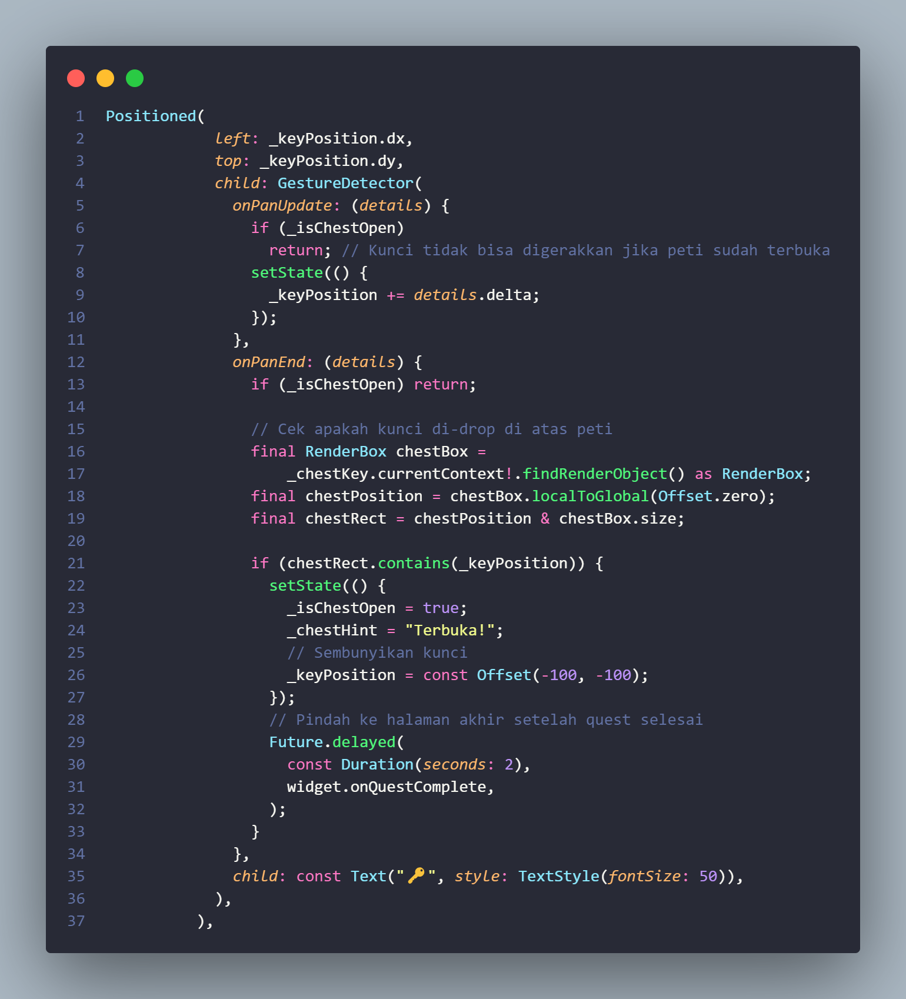
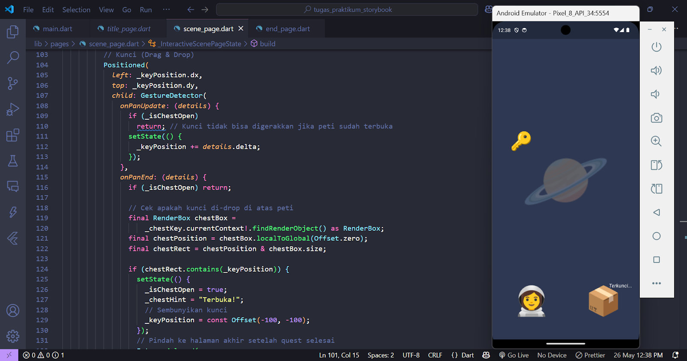

### 11. Uji Coba Interaksi

Gunakan hot reload dan uji coba:

* Double tap astronaut
* Long press peti
* Geser kunci ke peti

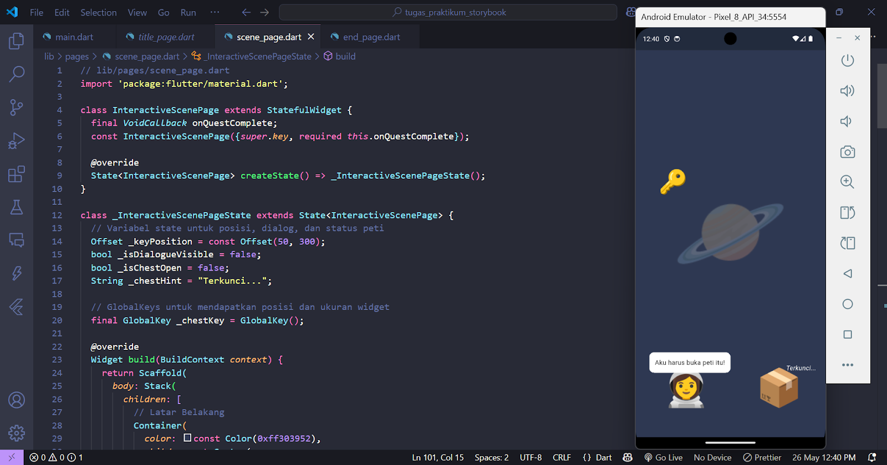
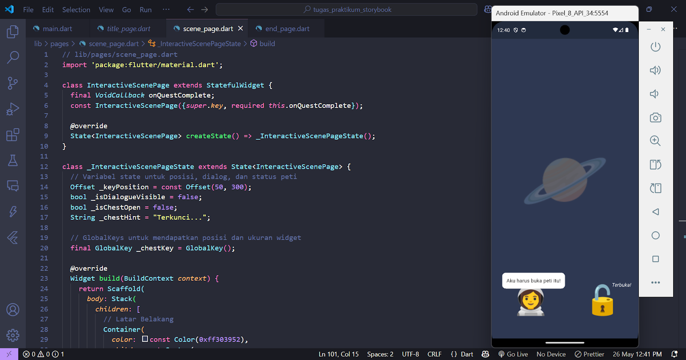

---

## 💡 Fitur Tambahan

### 12. Efek Visual Tombol (InkWell)

Buka `title_page.dart`, ganti `ElevatedButton` dengan `InkWell` dibungkus `Card` untuk efek klik yang lebih menarik.

### 13. Contoh Kode Tombol:

```dart
InkWell(
  onTap: () {
    // Navigasi ke scene
  },
  child: Card(
    child: Padding(
      padding: EdgeInsets.all(16),
      child: Text("Mulai"),
    ),
  ),
)
```

### 14–16. Scroll Background Secara Terbatas

Tambahkan `Offset` pada `State` untuk menyimpan posisi latar belakang dan memungkinkan pengguna menggulir ke satu arah (horizontal atau vertikal) dalam satu waktu.

### 17. Gunakan `RawGestureDetector` dan `Transform`

Bungkus `Container` latar belakang dengan widget di atas untuk menggerakkan background sesuai gesture.

### 18. Uji Geser Latar Belakang

Pastikan hanya satu sumbu yang bisa digeser dalam satu waktu.

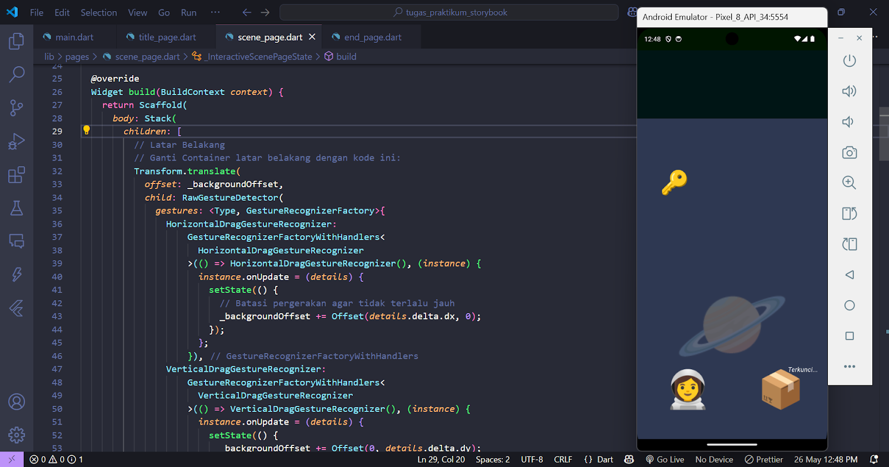

### 19–20. Zoom dan Pan dengan `InteractiveViewer`

Bungkus seluruh `Stack` pada `scene_page.dart` dengan `InteractiveViewer` untuk menambahkan fitur zoom dan pan.

```dart
InteractiveViewer(
  child: Stack(
    children: [
      // elemen-elemen di scene
    ],
  ),
)
```

### 21. Uji Coba Zoom & Pan

Gunakan pinch zoom dan drag untuk menguji fungsi interaktif ini.

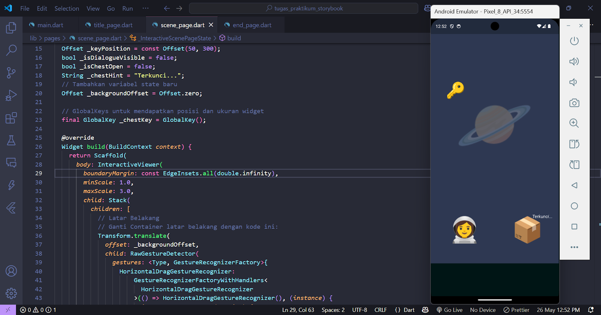

---

## ✅ Hasil Akhir

Aplikasi memiliki:

* Navigasi tiga halaman
* Gesture interaktif (double tap, long press, drag-drop)
* Efek visual pada tombol
* Scroll terbatas pada background
* Zoom & pan pada scene interaktif

---

## Screenshot Hasil Akhir:

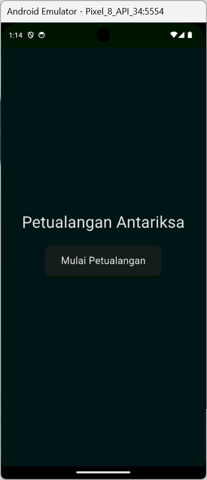
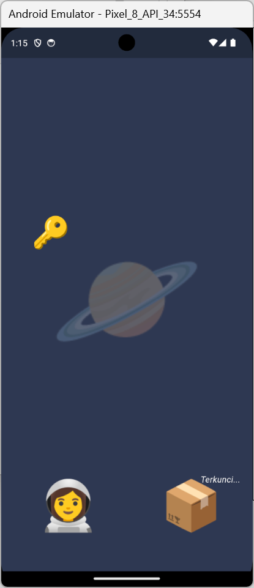
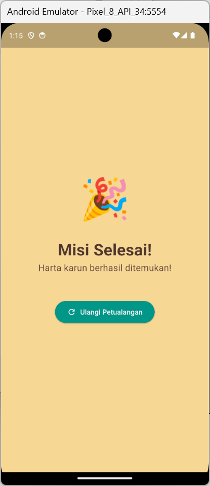
